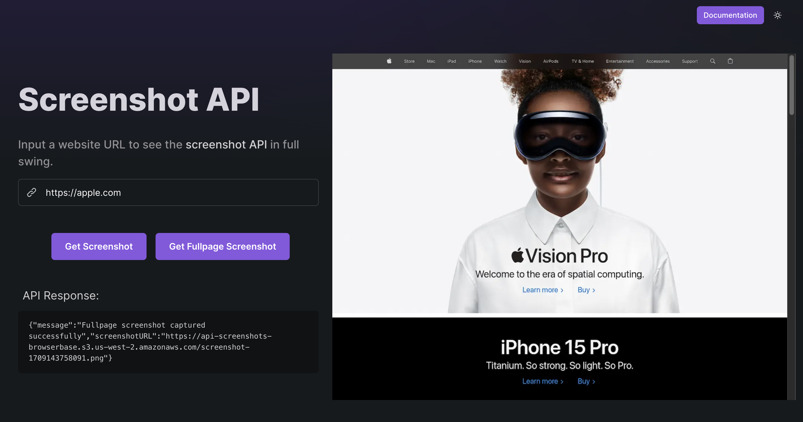
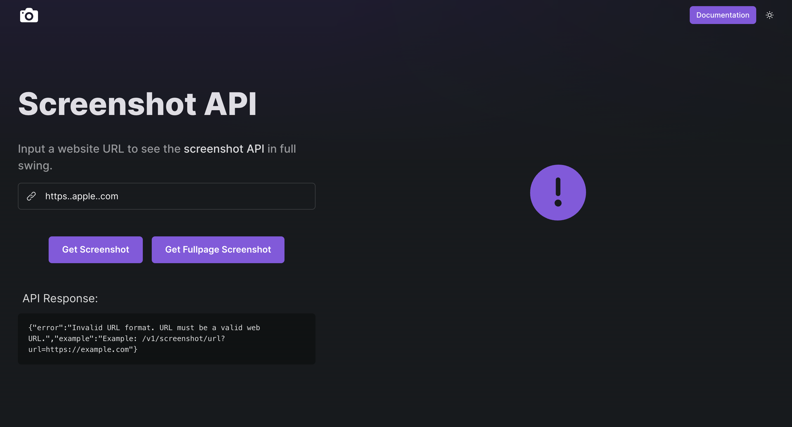

# Elliot Berdy Screenshot API

## Table of Contents

[Summary](#summary)  
[Endpoints](#endpoints)  
[Shortcomings and Next Steps](#shortcomings-and-next-steps)  
[The Development Story](#the-development-story)  
[Thank You!](#thank-you!)

## Summary

Hi! This is a **screenshot API** that can be used to receive either a regular of full page screenshot of a given url returned either as a base64 encoding or as a url to a .png file stored in an AWS S3 bucket. It is in it's early stages of development still but I hope you get a chance to play around with it!

The screenshot API uses Puppeteer to launch a browser instance, wait for the page and images to load, and then takes the screenshot.

You can see a potential use case for this API at the following link: [https://screenshot-api-app.onrender.com/](https://screenshot-api-app.onrender.com/). This web app allows you to input a url and visualize either the regular or full page screenshot in the browser, as well as the API response for that given request (note: this web app is using the endpoints that return a link to the screenshot).

## Endpoints

There are currently four available endpoints, each corresponding to either a regular of full page screenshot that either returns a base64 encoding of the image or a link to the image.

### 1. Get url for regular screenshot

> GET /v1/screenshot/url

Retrieves a url for the screenshot of the passed in url website.

### Request

    https://browserbase-work-trial.onrender.com/v1/screenshot/url

**cURL Request Example**

    curl -X GET "https://browserbase-work-trial.onrender.com/v1/screenshot/url?url=https://example.com/"

**Query parameters**

**url** | string (_required_)

Example: https://example.com/

Url of website to take screenshot of.

### Responses

**Content Type**

> 'application/json'

| Status Code | Response Examples                                                                                                                                              |
| ----------- | -------------------------------------------------------------------------------------------------------------------------------------------------------------- |
| 200         | `{"message":"Screenshot captured successfully","screenshotURL":"https://api-screenshots-browserbase.s3.us-west-2.amazonaws.com/screenshot-1709150937398.png"}` |
| 400         | `{"error":"URL parameter is required","example":"Example: /v1/screenshot/url?url=https://example.com"}`                                                        |
| 400         | `{"error":"Invalid URL format. URL must be a valid web URL.","example":"Example: /v1/screenshot/url?url=https://example.com"}`                                 |
| 500         | `{ "error": "Error capturing screenshot. Make sure url exists." }`                                                                                             |

### 2. Get url for full page screenshot

> GET /v1/screenshot/fullpage/url

Retrieves a url for the fulll page screenshot of the passed in url website.

### Request

    https://browserbase-work-trial.onrender.com/v1/screenshot/fullpage/url

**cURL Request Example**

    curl -X GET "https://browserbase-work-trial.onrender.com/v1/screenshot/fullpage/url?url=https://example.com/"

**Query parameters**

**url** | string (_required_)

Example: https://example.com/

Url of website to take screenshot of.

### Responses

**Content Type**

> 'application/json'

| Status Code | Response Examples                                                                                                                                                        |
| ----------- | ------------------------------------------------------------------------------------------------------------------------------------------------------------------------ |
| 200         | `{"message":"Full page screenshot captured successfully","screenshotURL":"https://api-screenshots-browserbase.s3.us-west-2.amazonaws.com/screenshot-1709150937398.png"}` |
| 400         | `{"error":"URL parameter is required","example":"Example: /v1/screenshot/fullpage/url?url=https://example.com"}`                                                         |
| 400         | `{"error":"Invalid URL format. URL must be a valid web URL.","example":"Example: /v1/screenshot/fullpage/url?url=https://example.com"}`                                  |
| 500         | `{ "error": "Error capturing screenshot. Make sure url exists." }`                                                                                                       |

### 3. Get regular screenshot base64 encoding

> GET /v1/screenshot

Retrieves a base64 encoding of the screenshot of the passed in url website.

### Request

    https://browserbase-work-trial.onrender.com/v1/screenshot

**cURL Request Example**

    curl -X GET "https://browserbase-work-trial.onrender.com/v1/screenshot?url=https://example.com/"

**Query parameters**

**url** | string (_required_)

Example: https://example.com/

Url of website to take screenshot of.

### Responses

**Content Type**

> 'application/json'

| Status Code | Response Examples                                                                                                          |
| ----------- | -------------------------------------------------------------------------------------------------------------------------- |
| 200         | `{"message":"Screenshot captured successfully","screenshotData":"iVBORw0KGgoAAAANSU...kJggg=="}`                           |
| 400         | `{"error":"URL parameter is required","example":"Example: /v1/screenshot?url=https://example.com"}`                        |
| 400         | `{"error":"Invalid URL format. URL must be a valid web URL.","example":"Example: /v1/screenshot?url=https://example.com"}` |
| 500         | `{ "error": "Error capturing screenshot. Make sure url exists." }`                                                         |

### 4. Get full page screenshot base64 encoding

> GET /v1/screenshot/fullpage

Retrieves a base64 encoding of the full page screenshot of the passed in url website.

### Request

    https://browserbase-work-trial.onrender.com/v1/screenshot/fullpage

**cURL Request Example**

    curl -X GET "https://browserbase-work-trial.onrender.com/v1/screenshot/fullpage?url=https://example.com/"

**Query parameters**

**url** | string (_required_)

Example: https://example.com/

Url of website to take screenshot of.

### Responses

**Content Type**

> 'application/json'

| Status Code | Response Examples                                                                                                                   |
| ----------- | ----------------------------------------------------------------------------------------------------------------------------------- |
| 200         | `{"message":"Full page screenshot captured successfully","screenshotData":"iVBORw0KGgoAAAANSU...kJggg=="}`                          |
| 400         | `{"error":"URL parameter is required","example":"Example: /v1/screenshot/fullpage?url=https://example.com"}`                        |
| 400         | `{"error":"Invalid URL format. URL must be a valid web URL.","example":"Example: /v1/screenshot/fullpage?url=https://example.com"}` |
| 500         | `{ "error": "Error capturing full page screenshot. Make sure url exists." }`                                                        |

## Shortcomings and Next Steps

### Concurrency and Scalability:

While the current deployment of the API on a starter instance on render.com is very convenient, it also comes with inherent limitations in terms of CPU access and RAM. As a result, during peak usage or when subjected to a high volume of simultaneous requests, the server may become overloaded, leading to prolonged response times, increased error rates, and potential service disruptions. Addressing these challenges requires implementing effective strategies to enhance both concurrency and scalability.

#### Scalability Strategies:

1.  **Horizontal Scaling with Render**: One option is to upgrade to more powerful instance types offered by Render or leverage Render's support for automatic horizontal scaling based on demand. This would allow the application to dynamically adjust its capacity to handle changes in traffic volume.

2.  **Alternative Providers or Serverless Computing**: There are alternative cloud providers that offer higher-performance instances or it could be worth considering adopting a serverless computing solution like AWS Lambda. Serverless architectures abstract away infrastructure management, allowing for seamless scaling without the need to provision or manage servers.

3.  **Containerization with Docker**: Embrace containerization technology such as Docker to package the API and its dependencies into portable, lightweight containers. Containerization facilitates consistent deployment across different environments and enables efficient scaling across multiple hosts or instances.

#### Concurrency Improvement Strategies:

Render provides a lot of the infrastructure and tools for these strategies. However, some of these strategies may require additional implementation, especially if the API is hosted elsewhere or on my own servers.

1.  **Request Queueing Mechanism**: Implement a request queuing mechanism to manage incoming requests during periods of high traffic. Queuing ensures that requests are processed in an orderly fashion, preventing overload and maintaining responsiveness.

2.  **Concurrency Limit and Load Balancing**: Set a concurrency limit to control the number of concurrent requests that the server can handle. Additionally, leverage load balancing techniques to evenly distribute incoming traffic across multiple server instances, optimizing resource utilization and enhancing scalability.

3.  **Caching Mechanism for Improved Response Times**: Introduce caching mechanisms to alleviate the need for repetitive browser instance launches and page loads. By caching frequently accessed data, certain API requests can be fulfilled more quickly, reducing latency and improving overall performance.

By implementing some or all of these strategies in combination, I could improve the resiliency and performance of the API.

### Added API Customization

The API currently offers users the flexibility to choose between regular screenshots or full-page screenshots, as well as the option to receive the image as a base64 encoding or as a URL. However, expanding the range of customizable features can further empower users and cater to a wider array of requirements. Here are some potential enhancements:

- **Viewport Size Customization**: Allow users to specify the viewport dimensions, enabling simulation of different device resolutions or screen sizes.

- **Resolution Settings**: Provide options for users to define the resolution of captured screenshots, offering flexibility in output quality.

- **Screenshot Format Selection**: Support various image formats like JPEG, PNG, etc., giving users the freedom to choose based on their preferences or application requirements.

- **Custom Wait Strategies**: Enable users to define criteria for determining when a page is ready for screenshot capture, allowing for tailored wait strategies based on specific page characteristics or content loading behaviors.

- **Support for Different Browsers**: Introduce compatibility with different web browsers, providing users with the option to capture screenshots using their preferred browser environment (this may not be reasonable while using the Puppeteer library).

While this list isn't exhaustive, these additional customizations could significantly enhance the versatility and usability of the API, catering to a diverse range of user needs and scenarios.

### Loading Images

On certain larger webpages, not all images fully load before the screenshot is captured. Currently, the API relies on Puppeteer's `{waitUntil: "networkidle2"}` and `"load"`, which entails waiting for no more than two network connections for at least 500 ms and for the load event to fire. While this approach generally does a good job of loading images for a given page, it is not always entirely effective for larger pages.

One potential enhancement is to incorporate the Largest Contentful Paint (LCP) parameter. This metric signifies how quickly the main content of a web page loads, specifically measuring the time from when the user initiates loading the page until the largest image or text block is rendered within the viewport. By waiting for this amount of time before taking the screenshot, we can help ensure that the images fully load.

However, some webpages feature lazy-loaded images, requiring users to scroll down the webpage for the image to start loading. The strategies mentioned above may not address these images. To capture them, the API might need to utilize Puppeteer to scroll through the website before taking the screenshot.

### Web App Design

The current web app that utilizes the API to display a screenshot of a given url is not currently optimized for all screen sizes. The web app needs to be updated to adjust styling and positioning based on what size screen is being used.

## The Development Story

In this section, I am aiming to give insight into the development process and how and why I made certain decisions and tradeoffs. To start off, we will assume I was given the basic task of "build a screenshot API". The API should be given a URL and return a screenshot and should not use a prebuilt screenshot API :)

### Choosing a programmable browser library

The first task I started researching and thinking about was what library I wanted to use for taking the screenshot. I had heard about a couple of libraries for programmable browsers, but I did not know much about them so I started by researching about them.

I came across four popular options: Selenium, Playwright, Cypress, and Puppeteer. Below is a table I put together that shows some strengths and considerations about each one.

| Tool               | Strengths                                                                                                                                                                               | Considerations                                                                                                                                                                                                                                                   |
| ------------------ | --------------------------------------------------------------------------------------------------------------------------------------------------------------------------------------- | ---------------------------------------------------------------------------------------------------------------------------------------------------------------------------------------------------------------------------------------------------------------- |
| Selenium WebDriver | - Widely used - Supports multiple programming languages - Good community support - Extensive documentation - Effective for capturing screenshots of web pages               | - Might require more setup compared to some other tools - Primarily designed for end-to-end testing, might be seen as overkill for just capturing screenshots - If already familiar with Selenium or prefer its ecosystem, it can still be a viable option |
| Playwright         | - Developed by Microsoft - Powerful capabilities for browser automation - Supports multiple programming languages - Features like cross-browser testing and headless mode      | - Ecosystem might not be as mature as other tools - Actively maintained, but still gaining popularity - Tailored for modern web development workflows                                                                                                      |
| Cypress            | - Easy to use - Fast and reliable testing capabilities - Can capture screenshots effectively                                                                                      | - Optimized for testing rather than general-purpose web automation - Using it solely for screenshot capture might not leverage its full capabilities - Tests run in controlled environments, may differ from production environments                       |
| Puppeteer          | - Developed by Google - Specifically designed for automating tasks in Chromium-based browsers - High-level API for automation tasks like screenshot capture, PDF generation, etc. | - Chrome/Chromium-specific, may lack cross-browser compatibility - Easy to use with excellent documentation - Well-suited for headless browser automation, including screenshot capture                                                                    |

After doing this research, I came to the conclusion that I wanted to use Puppeteer. It seemed to be simple to use, have a lot of good documentation, and be well suited for simple automation tasks like taking a screenshot. The biggest drawback Puppeteer had for this use case was that it is Chrome specific, but I did not foresee that being an issue for this project.

### Building a simple API that can take a screenshot

Once I had chosen to use Puppeteer, the next step was to get familiar with it and build a really simple version of the API - an MVP if you will. I found the following simple code to open a web page and take a screenshot of it:

    const puppeteer = require('puppeteer');
    (async () => { const browser = await puppeteer.launch();
    const page = await browser.newPage();
    await page.goto('https://example.com');
    await page.screenshot({ path: 'example.png' });
    await browser.close(); })();

I used this code to set up an API endpoint that when given a url, essentially ran this code leading to a screenshot of the webpage being stored locally.

The next step was having the API return the image to the user instead of saving it locally. There were two ways I thought about going about implementing this. One was to return some sort of encoding of the image, and the other was to store the image somewhere and return a URL to that stored image.

Below is a table demonstrating the pros and cons I came up with for each:

| Pros of base64                             | Cons of base64                                 |
| ------------------------------------------ | ---------------------------------------------- |
| - Simple                                   | - Increased payload size                       |
| - Don't need additional storage            | - Limited scalability                          |
| - Client receives the screenshot instantly | - Consumes more CPU resources to render base64 |

| Pros of storing and returning URL                                              | Cons of storing and returning URL |
| ------------------------------------------------------------------------------ | --------------------------------- |
| - Reduced payload size                                                         | - Need additional storage         |
| - More scalable                                                                | - More complex                    |
| - Allows for flexibility in terms of doing things later on with the screenshot | - Depends on external services    |

I came to the conclusion that ultimately storing the image somewhere and returning a URL to it would be better overall, but Puppeteer makes it really easy to receive the screenshot in a base64 encoding, so I went with that for simplicity at this point with the intention of implementing the URL version later down the line.

Puppeteer also has an easy way of taking a full page screenshot, so I went ahead and created another endpoint that would return the full page screenshot in the base64 encoding as well.

The last thing I wanted to include in the "MVP" was some basic error checking. I wanted to make sure that a url was always provided and that the url was properly formatted. In JavaScript, if you create a new URL object with the passed in URL, it will throw an error if the URL format is not valid. Therefore, I used that strategy to guarantee that the URL was at least formatted properly. I also threw an error if there was an error while taking the screenshot or if the URL did not exist.

Once I got all of that working, I was left with two API endpoints that when given a URL, could return the base64 encoding of a regular or full page screenshot of that webpage.

### Deploying the API

Now that I had a basic functional API, my next step was to deploy the API. My next decision was to decide whether I wanted to use a Platform as a Service (PaaS) or Infrastructure as a service (IaaS). Below is a table detailing the pros and cons I came up with after some research:

| Aspect | Infrastructure-as-a-Service (IaaS)                                                                                                                                                                     | Platform-as-a-Service (PaaS)                                                                                                                                                             |
| ------ | ------------------------------------------------------------------------------------------------------------------------------------------------------------------------------------------------------ | ---------------------------------------------------------------------------------------------------------------------------------------------------------------------------------------- |
| Pros   | - Flexibility: Provides full control over infrastructure components, allowing customization and configuration according to specific requirements.                                                      | - Simplicity: Abstracts away infrastructure management, making deployment and management easier, especially for developers without deep expertise in infrastructure management.          |
|        | - Scalability: Offers scalability with the ability to scale resources up or down based on demand, allowing applications to handle varying workloads effectively.                                       | - Rapid Development: Provides tools and services for automating deployment, scaling, and monitoring, enabling rapid development and iteration of applications.                           |
|        | - Control: Allows fine-grained control over security, networking, and other infrastructure aspects, enabling customization and optimization based on application needs.                                | - Managed Services: Includes managed services such as databases, caching, and monitoring, reducing the operational overhead of managing these components separately.                     |
|        | - Vendor Neutrality: Offers the flexibility to choose from multiple cloud providers or even run on-premises infrastructure, reducing the risk of vendor lock-in.                                       | - Cost-Effectiveness: Often follows a pay-as-you-go pricing model, making it cost-effective for startups and small businesses, with no upfront investment in infrastructure.             |
| Cons   | - Complexity: Requires expertise in managing infrastructure components, including provisioning, configuration, and maintenance, which can be complex and time-consuming.                               | - Limited Control: Provides less control over underlying infrastructure components, limiting customization options and flexibility for applications with specific requirements.          |
|        | - Management Overhead: Involves managing and maintaining infrastructure components, including updates, patches, and security configurations, which can add operational overhead.                       | - Dependency on Provider: Relies on the provider for availability, support, and feature updates, which may limit control and flexibility and result in vendor lock-in.                   |
|        | - Scalability Management: Requires manual management of scalability aspects, such as provisioning additional resources and load balancing, which may be challenging to optimize and scale efficiently. | - Customization Constraints: May impose constraints on application customization and configuration, limiting the ability to tailor the environment to specific requirements.             |
|        | - Cost Considerations: While scalable, costs can increase with resource usage, and careful monitoring and optimization are needed to control expenses effectively.                                     | - Portability: Adapting applications to run on different PaaS platforms or migrating to alternative platforms may be challenging due to vendor-specific configurations and dependencies. |

After weighing the pros and cons, I decided to go with a PaaS. Given the scope of the project, I figured that simplicity, rapid development, and cost effectiveness were more important to me than the flexibility and scalability that IaaS would provide.

I briefly looked into various PaaS options, however I had previously used Render on multiple occasions for other projects and new how to use it and that it worked well, so I decided to use it for the API.

This left me with a deployed API that could be given a URL and return the base64 encoding of either a regular or full page screenshot of the website!

### Making sure images are fully loaded

While the deployed API was working, I noticed that for some websites not all of the images had fully loaded before the screenshot was taken. This was especially true for the full page screenshots. After some research, I discovered that Puppeteer allows you to wait for certain events before taking the screenshot. I decided to use a combination of two events: **networkidle2** and **load**.

- **networidle2** - wait for no more than two network connections for at least 500 ms before moving on to the next line of code
- **load** - ensure that all resources, including scripts, stylesheets, and images, have been fully loaded before moving on to the next line of code

This seemed to mostly solve the issue except for really large webpages and webpages that used "lazy load," which means the user must scroll down to the image for the image to start loading. I address this more earlier on in the shortcomings and next steps section, but I seemed to be getting the same results as the Chrome developer tool screenshot and therefore decided that this was a good enough benchmark at least for the time being.

### Store the screenshot somewhere and return a URL

I decided the next step would be to implement a version of the API that would return a URL to the screenshot instead of returning the base64 encoding of the image.

Before implementing this, I had to decide how and where I would store the images. Below are the options I came up with and their pros and cons:

1. **Store images on the server**

   - **Pros**:
     - Efficient for serving large numbers of images.
     - Allows you to leverage existing web server software (e.g., Apache, Nginx) for serving static files.
   - **Cons**:
     - Requires managing file storage and ensuring proper permissions are set up.
     - May require additional infrastructure for scalability and redundancy.
     - Depending on your setup, you may need to implement access control mechanisms to restrict access to certain images - security concerns

2. **Use cloud storage**

   - **Pros**:
     - Highly scalable and reliable storage solutions.
     - Can easily integrate with other cloud services for additional functionality (e.g., CDN for caching, access control).
     - Often provides built-in features for generating signed URLs for secure access to private resources.
       - security!
   - **Cons**:
     - Incurs costs based on storage and bandwidth usage.
     - Requires managing credentials and configuring access policies for secure access.

3. **Store images in a database**
   - **Pros**:
     - Centralized storage and management of images alongside other data.
     - Provides flexibility to manipulate images (e.g., resizing, cropping) before serving.
   - **Cons**:
     - Can lead to increased database load, especially for high-traffic applications.
     - May require additional effort for implementing image manipulation and caching mechanisms.
     - Depending on the database technology, may have limitations on the size and type of data that can be stored efficiently.

I ultimately decided to go with a cloud based solution as they are easy to scale, are built to perform well, have some built in security and reliability, and don't require much management. I further chose to use AWS S3 due to it's reliability, documentation, and ease of use.

Once I had made that decision, I began implementing. I created an S3 bucket for storing the images and created two new API endpoints: one that returns a URL to a regular screenshot and one that returns a URL to a full page screenshot.

The API takes the screenshot and uploads the binary encoding of it to the bucket. In return, AWS S3 gives a URL to the image which is then given to the user.

By the end of this stage, I had a deployed API that was able to return either a base64 encoding or a URL to a regular or full page screenshot of a given URL.

### Build a web app that utilizes the API

Given that I had a working API (despite scalability being a concern), I decided to build a web app that utilizes the API for future potential users to see and to help continue to develop my frontend skills. I decided this app would be one in which the user could input a URL and then visualize either the regular or full page screenshot of that website, as well as the corresponding API response.

I decided to "hackathon" the creation of this web app and therefore in the interest of time decided to use a template as a starting point. This way I didn't have to build everything from scratch and would have some formatting and styling already done for me.

I used the following template: https://nextjstemplates.com/templates/saas-ui

I then spent some time getting familiar with the code and deciding which parts I wanted to keep and which I wanted to get rid of. While the template made things easier in terms of not having to make everything from scratch, making sure everything was set up properly and learning the code base and technologies the code used also took a decent chunk of time. Therefore, I am not sure I would for sure go that route again in the future, especially if I had more time.

That being said, I started coding away and adding elements and features to the web app. Some notable features that I added:

- an input field for the user to type in the URL
- buttons to trigger the API for either a regular or full page screenshot
- displaying the screenshot once it has been received
- loading signs on the buttons showing that the screenshot was on its way (the API has to wait for the page to load which takes some time)
- code box that displays the API response
- error handling - if the user inputs an invalid URL or if the API returns an error, the web app displays an error icon

The web app hasn't been fully optimized for every screen size, although I believe it looks good on a normal laptop screen and looks good enough on mobile screens and larger screens. This could be an area of improvement in the future though.

After I had gotten the web app to a place I was happy with, the next two steps were deploying it and cleaning up the code base (it had a lot of extra code from the template). For the same reasons as earlier, I decided to host the app with render. That process was pretty easy and straightforward. Cleaning up the codebase consisted mostly of deleting code that wasn't being used anymore and some minor formatting.

By the end of this stage I had a working screenshot API and a web app that looked nice and was able to utilize the API to display the screenshot!

As mentioned earlier, the web app can be viewed here: [https://screenshot-api-app.onrender.com/](https://screenshot-api-app.onrender.com/). This image shows the screenshot and API response for https://apple.com.

and this image shows what happens if you input an invalid URL.

### Documentation

The last step in this process was creating the documentation for the API and documenting this entire process.

## Thank You!

Thanks for reading - I hope you enjoyed!
